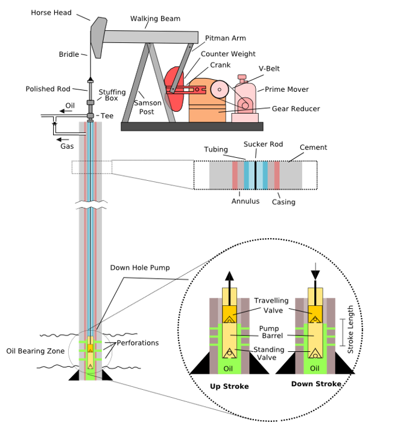

## project Delivery of Mechanisms
For this project, the solution to a real-life problem was proposed using three-position mechanism synthesis. The input requirements and constraints were defined, and a graphic synthesis was performed to build an animated CAD or real model of the mechanism demonstrating the functionality of the solution.
## Mechanism Selected for the Project
We chose the crude oil extractor as our mechanism. Below, we show its components and design. 

## Synthesis of the Mechanism
The rod pump is an essential part of oil extraction. It is installed in oil wells and is used to mechanically lift liquid from the well when natural pressure is insufficient. These pumps are common in oil fields and produce a mixture of crude oil and water. Their size varies depending on the depth of the well, and their characteristic movement is achieved by a crank-connecting rod mechanism. In the past, a similar mechanism was used with steam engines to drain coal mines in the 16th and 17th centuries. 

### Motor and Drive:
The rod pump is driven by a motor, which can be electric or gas-powered. The motor rotates a shaft, which in turn moves a pair of articulated support arms.
### Reciprocating Motion:
The support arms cause the attached “head” or beam to rise and fall in a constant pattern. The beam is free to move in an A-shaped frame.
Connection to the Well: At the end of the beam, there is a curved metal box called a head. A steel cable (or sometimes fiberglass) connects the head to the polished rod.
### Oil Extraction: 
The rod descends into the well and compresses the air in the cylinder. The pressure of the compressed air pushes the head upward, extracting oil from the ground.
### Characteristic Pitching Motion:
The crank mechanism converts the rotary motion of the engine into a vertical reciprocating motion. This characteristic pitching motion is what drives the pump rod.

## Synthesis of the Mechanism and the Dyad

